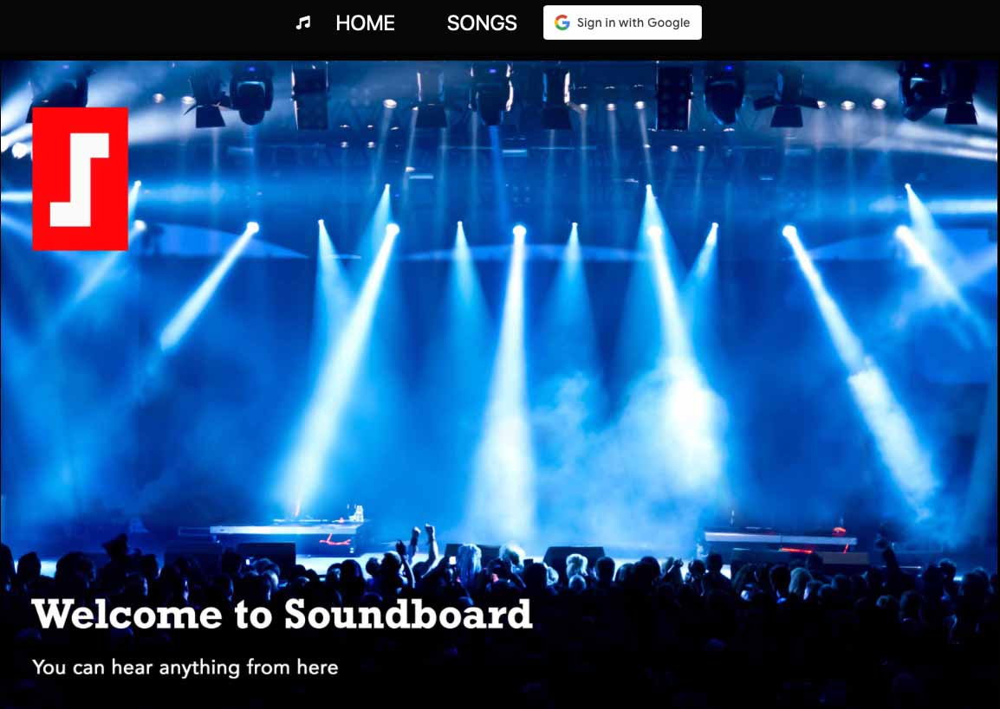

**Soundboard**

Soundboard is a database that stores all my favorite songs and upcoming concert dates for those artists.  I love music and seeing live acts.  This helps me manage that process in one place.  Also, my friends can see the type of music I like and tell me if they want to go to a show with me.

Let's get started.  Here's [Soundboard](https://song-collector.fly.dev/).

Here are my planning [materials](https://trello.com/b/hLlHtnd9/song-collector).

Technologies Used 💾

- Embedded JavaScript
- HTML
- CSS
- git
- Mongoose/MongoDB
- Express
- Node.js
- Adobe Photoshop

Credits 🙌

 - Concert photo from Adobe Stock.

Ice Box 🧊

- [ ] Rate a song from 1 to 5 stars.
- [ ] Sort the songs by their star rating.
- [ ] Click on a button next to the concert review data and add a review.
- [ ] Click on a concert date and see all the reviews.
